<h1 align="center">
StackOverflow
</h1>

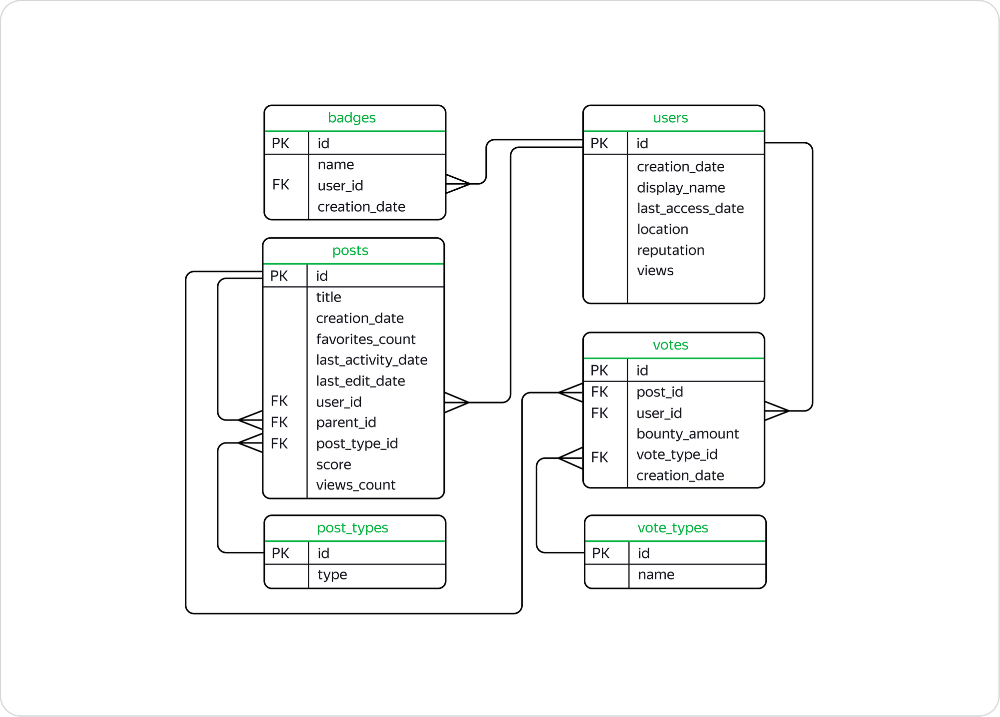

## Проект: Анализ StackOverflow с помощью SQL

**Описание проекта:**

Данный проект посвящен решению SQL-задач и анализу данных с использованием базы данных **StackOverflow** в системе управления базами данных **PostgreSQL**. StackOverflow - это популярный сервис вопросов и ответов, посвященный программированию и связанным с ним темам.

В рамках проекта будет использоваться версия базы данных, содержащая данные о постах, опубликованных на сайте в 2008 году и ранее. Проект состоит из двух основных частей, призванных продемонстрировать практическое применение SQL и аналитические возможности.

Первая часть включает в себя решение ряда задач в SQL-тренажёре. Эти задачи позволят вам применить на практике ваши знания SQL и научиться извлекать информацию из базы данных, отработать навыки написания запросов, манипуляции данными и использования различных функций и операторов SQL.

Вторая часть проекта носит аналитический характер. В этой части будет прадеставленн анализ данных StackOverflow, используя мощные инструменты SQL анализ данных, извлекать из них ценные сведения и делать выводы. Эта часть проекта позволит развить навыки анализа данных и научиться использовать SQL для получения ценной информации из больших наборов данных.

Проект предоставляет отличную возможность не только улучшить свои навыки SQL, но и получить практический опыт работы с реальной базой данных и углубить понимание анализа данных.

**Цель проекта:**

Продемонстрировать практическое применение SQL и аналитические возможности на реальном наборе данных. Проект направлен на решение SQL-задач и анализ данных из базы данных сервиса StackOverflow, посвященного программированию. Первая часть включает в себя решение задач в SQL-тренажёре, а вторая часть - это аналитический анализ данных с извлечением ценных сведений и выводов. Проект позволит улучшить навыки SQL, получить опыт работы с базой данных и углубить понимание анализа данных.

**Описание данных**

* **Таблица `stackoverflow.badges`** 

   Хранит информацию о значках, которые присуждаются за разные достижения. Например, пользователь, правильно ответивший на большое количество вопросов про PostgreSQL, может получить значок postgresql.


<table>
<thead>
<tr><th>Поле</th><th>Описание</th></tr>
</thead>
<tbody>
<tr>
<td>id</td>
<td>Идентификатор значка, первичный ключ таблицы</td>
</tr>
<tr>
<td>name</td>
<td>Название значка</td>
</tr>
<tr>
<td>user_id</td>
<td>Идентификатор пользователя, которому присвоили значок, внешний ключ, отсылающий к таблице users</td>
</tr>
<tr>
<td>creation_date</td>
<td>Дата присвоения значка</td>
</tr>
</tbody>
</table>


**Таблица `stackoverflow.post_types`** 

Содержит информацию о типе постов. Их может быть два:

- `Question` — пост с вопросом;
- `Answer` — пост с ответом.

<table>
<thead>
<tr><th>Поле</th><th>Описание</th></tr>
</thead>
<tbody>
<tr>
<td>id</td>
<td>Идентификатор типа поста, первичный ключ таблицы</td>
</tr>
<tr>
<td>type</td>
<td>Тип поста</td>
</tr>
</tbody>
</table>

**Таблица `stackoverflow.posts`** 

Содержит информацию о постах.

<table>
<thead>
<tr><th>Поле</th><th>Описание</th></tr>
</thead>
<tbody>
<tr>
<td>id</td>
<td>Идентификатор поста, первичный ключ таблицы</td>
</tr>
<tr>
<td>title</td>
<td>Заголовок поста</td>
</tr>
<tr>
<td>creation_date</td>
<td>Дата создания поста</td>
</tr>
<tr>
<td>favorites_count</td>
<td>Число, которое показывает, сколько раз пост добавили в «Закладки»</td>
</tr>
<tr>
<td>last_activity_date</td>
<td>Дата последнего действия в посте, например комментария</td>
</tr>
<tr>
<td>last_edit_date</td>
<td>Дата последнего изменения поста</td>
</tr>
<tr>
<td>user_id</td>
<td>Идентификатор пользователя, который создал пост, внешний ключ к таблице users</td>
</tr>
<tr>
<td>parent_id</td>
<td>Если пост написали в ответ на другую публикацию, в это поле попадёт идентификатор поста с вопросом</td>
</tr>
<tr>
<td>post_type_id</td>
<td>Идентификатор типа поста, внешний ключ к таблице post_types</td>
</tr>
<tr>
<td>score</td>
<td>Количество очков, которое набрал пост</td>
</tr>
<tr>
<td>views_count</td>
<td>Количество просмотров</td>
</tr>
</tbody>
</table>

**Таблица `stackoverflow.users`** 

Содержит информацию о пользователях.

<table>
<thead>
<tr><th>Поле</th><th>Описание</th></tr>
</thead>
<tbody>
<tr>
<td>id</td>
<td>Идентификатор пользователя, первичный ключ таблицы</td>
</tr>
<tr>
<td>creation_date</td>
<td>Дата регистрации пользователя</td>
</tr>
<tr>
<td>display_name</td>
<td>Имя пользователя</td>
</tr>
<tr>
<td>last_access_date</td>
<td>Дата последнего входа</td>
</tr>
<tr>
<td>location</td>
<td>Местоположение</td>
</tr>
<tr>
<td>reputation</td>
<td>Очки репутации, которые получают за хорошие вопросы и полезные ответы</td>
</tr>
<tr>
<td>views</td>
<td>Число просмотров профиля пользователя</td>
</tr>
</tbody>
</table>

**Таблица `stackoverflow.vote_types`** 

Содержит информацию о типах голосов. Голос — это метка, которую пользователи ставят посту. Типов бывает несколько: 

* UpMod — такую отметку получают посты с вопросами или ответами, которые пользователи посчитали уместными и полезными.
* DownMod — такую отметку получают посты, которые показались пользователям наименее полезными.
* Close — такую метку ставят опытные пользователи сервиса, если заданный вопрос нужно доработать или он вообще не подходит для платформы.
* Offensive — такую метку могут поставить, если пользователь ответил на вопрос в грубой и оскорбительной манере, например, указав на неопытность автора поста.
* Spam — такую метку ставят в случае, если пост пользователя выглядит откровенной рекламой.

<table>
<thead>
<tr><th>Поле</th><th>Описание</th></tr>
</thead>
<tbody>
<tr>
<td>id</td>
<td>Идентификатор типа голоса, первичный ключ</td>
</tr>
<tr>
<td>name</td>
<td>Название метки</td>
</tr>
</tbody>
</table>

**Таблица `stackoverflow.votes`**

Содержит информацию о голосах за посты. 

<table>
<thead>
<tr><th>Поле</th><th>Описание</th></tr>
</thead>
<tbody>
<tr>
<td>id</td>
<td>Идентификатор голоса, первичный ключ</td>
</tr>
<tr>
<td>post_id</td>
<td>Идентификатор поста, внешний ключ к таблице posts</td>
</tr>
<tr>
<td>user_id</td>
<td>Идентификатор пользователя, который поставил посту голос, внешний ключ к таблице users</td>
</tr>
<tr>
<td>bounty_amount</td>
<td>Сумма вознаграждения, которое назначают, чтобы привлечь внимание к посту</td>
</tr>
<tr>
<td>vote_type_id</td>
<td>Идентификатор типа голоса, внешний ключ к таблице vote_types</td>
</tr>
<tr>
<td>creation_date</td>
<td>Дата назначения голоса</td>
</tr>
</tbody>
</table>

## Практическая часть

### Запрос №1

Найдите количество вопросов, которые набрали больше 300 очков или как минимум 100 раз были добавлены в «Закладки».

<table>
<thead>
<tr><td>Code</tr>
</thead>
<tbody>
<tr>
<td>

```sql
SELECT COUNT(id)
FROM stackoverflow.posts
WHERE (score > 300 OR favorites_count >= 100) AND post_type_id = 1;
```
</tr>
<tr>
<td>Result</tr>
<tr>
<td>

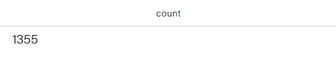
</tr>
</tbody>
</table>

### Запрос №2

Сколько в среднем в день задавали вопросов с 1 по 18 ноября 2008 включительно? Результат округлите до целого числа.

<table>
<thead>
<tr><td>Code</tr>
</thead>
<tbody>
<tr>
<td>

```sql
WITH 
questions AS (SELECT DISTINCT(CAST(DATE_TRUNC('day', p.creation_date) AS DATE)),
           COUNT(p.id) OVER (PARTITION BY CAST(DATE_TRUNC('day', p.creation_date) AS DATE))
    FROM stackoverflow.posts AS p
    LEFT JOIN stackoverflow.post_types AS pt ON p.post_type_id = pt.id 
    WHERE pt.type = 'Question' AND (CAST(DATE_TRUNC('day', p.creation_date) AS DATE) BETWEEN '2008.11.01' AND '2008.11.18'))
SELECT ROUND(AVG(count))::int 
FROM questions; 
```
</tr>
<tr>
<td>Result</tr>
<tr>
<td>

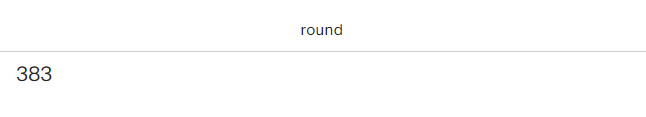
</tr>
</tbody>
</table>

### Запрос №3

Сколько пользователей получили значки сразу в день регистрации? Выведите количество уникальных пользователей.

<table>
<thead>
<tr><td>Code</tr>
</thead>
<tbody>
<tr>
<td>

```sql
SELECT COUNT(DISTINCT(u.id))
FROM stackoverflow.users u
LEFT JOIN stackoverflow.badges b ON u.id=b.user_id
WHERE DATE_TRUNC('day',u.creation_date)::DATE = DATE_TRUNC('day',b.creation_date)::DATE; 
```
</tr>
<tr>
<td>Result</tr>
<tr>
<td>

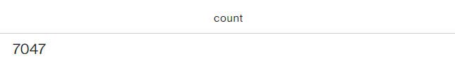
</tr>
</tbody>
</table>

### Запрос №4

Сколько уникальных постов пользователя с именем Joel Coehoorn получили хотя бы один голос?

<table>
<thead>
<tr><td>Code</tr>
</thead>
<tbody>
<tr>
<td>

```sql
WITH
name_id AS (SELECT id
    FROM stackoverflow.users
    WHERE display_name = 'Joel Coehoorn'),

post_votes AS (SELECT post_id
    FROM stackoverflow.votes
    GROUP BY post_id
    HAVING COUNT(*) > 0)

SELECT COUNT(DISTINCT p.id)
FROM stackoverflow.posts p
JOIN name_id ni ON p.user_id = ni.id
JOIN post_votes pv ON p.id = pv.post_id;
```
</tr>
<tr>
<td>Result</tr>
<tr>
<td>

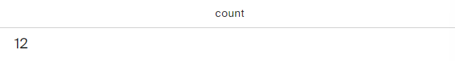
</tr>
</tbody>
</table>

### Запрос №5

Выгрузите все поля таблицы `vote_types`. Добавьте к таблице поле `rank`, в которое войдут номера записей в обратном порядке. Таблица должна быть отсортирована по полю `id`.

<table>
<thead>
<tr><td>Code</tr>
</thead>
<tbody>
<tr>
<td>

```sql
SELECT *,
    RANK () OVER (ORDER BY id DESC) AS rank
FROM stackoverflow.vote_types    
ORDER BY id
LIMIT 5;
```
</tr>
<tr>
<td>Result</tr>
<tr>
<td>

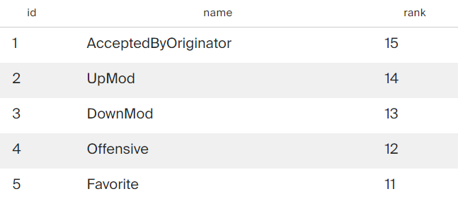
</tr>
</tbody>
</table>

### Запрос №6

Отберите 10 пользователей, которые поставили больше всего голосов типа `Close`. Отобразите таблицу из двух полей: идентификатором пользователя и количеством голосов. Отсортируйте данные сначала по убыванию количества голосов, потом по убыванию значения идентификатора пользователя.

<table>
<thead>
<tr><td>Code</tr>
</thead>
<tbody>
<tr>
<td>

```sql
SELECT DISTINCT(user_id),
    COUNT(id) OVER(PARTITION BY user_id) AS vote
FROM stackoverflow.votes
WHERE vote_type_id = 6
ORDER BY vote DESC, user_id DESC
LIMIT 10;
```
</tr>
<tr>
<td>Result</tr>
<tr>
<td>

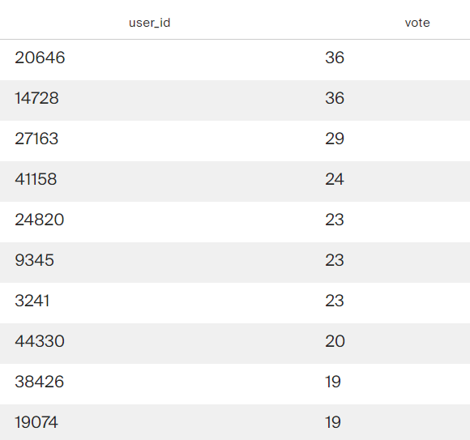
</tr>
</tbody>
</table>

### Запрос №7

Отберите 10 пользователей по количеству значков, полученных в период с 15 ноября по 15 декабря 2008 года включительно.

Отобразите несколько полей:

* идентификатор пользователя;
* число значков;
* место в рейтинге — чем больше значков, тем выше рейтинг.

Пользователям, которые набрали одинаковое количество значков, присвойте одно и то же место в рейтинге.

Отсортируйте записи по количеству значков по убыванию, а затем по возрастанию значения идентификатора пользователя.

<table>
<thead>
<tr><td>Code</tr>
</thead>
<tbody>
<tr>
<td>

```sql
SELECT user_id,
    COUNT(id),
    DENSE_RANK() OVER(ORDER BY COUNT(id) DESC)
FROM stackoverflow.badges
WHERE creation_date::DATE BETWEEN '2008-11-15' AND '2008-12-15'
GROUP BY user_id
ORDER BY COUNT (id) DESC,user_id
LIMIT 10;
```
</tr>
<tr>
<td>Result</tr>
<tr>
<td>

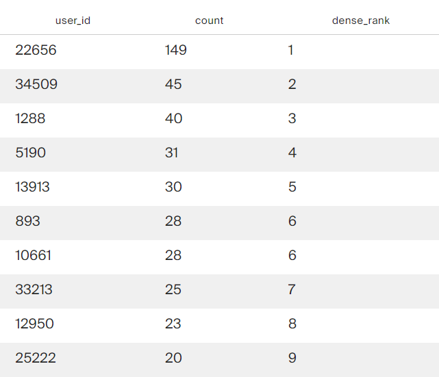
</tr>
</tbody>
</table>

### Запрос №8

Сколько в среднем очков получает пост каждого пользователя?

Сформируйте таблицу из следующих полей:

* заголовок поста;

* идентификатор пользователя;

* число очков поста;

* среднее число очков пользователя за пост, округлённое до целого числа.

Не учитывайте посты без заголовка, а также те, что набрали ноль очков.

<table>
<thead>
<tr><td>Code</tr>
</thead>
<tbody>
<tr>
<td>

```sql
SELECT title,
    user_id,
    score,
    ROUND(AVG(score) OVER (PARTITION BY user_id))
FROM stackoverflow.posts
WHERE title IS NOT NULL AND score != 0
LIMIT 5;
```
</tr>
<tr>
<td>Result</tr>
<tr>
<td>

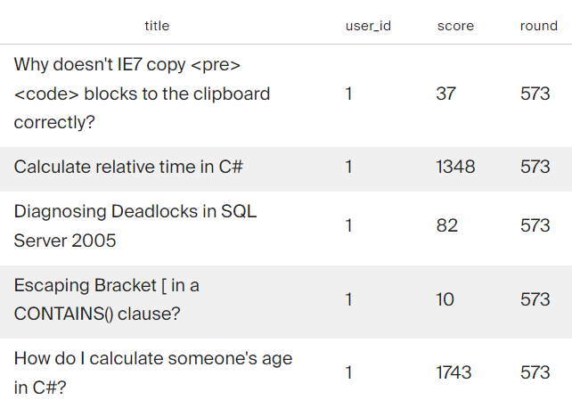
</tr>
</tbody>
</table>

### Запрос №9

Отобразите заголовки постов, которые были написаны пользователями, получившими более 1000 значков. Посты без заголовков не должны попасть в список.

<table>
<thead>
<tr><td>Code</tr>
</thead>
<tbody>
<tr>
<td>

```sql
WITH
users AS (SELECT user_id,
    COUNT(creation_date) count_badges
FROM stackoverflow.badges  b
GROUP BY user_id
HAVING COUNT(creation_date) > 1000)

SELECT title
FROM stackoverflow.posts p
WHERE user_id = (SELECT user_id FROM users) AND title IS NOT NULL;
```
</tr>
<tr>
<td>Result</tr>
<tr>
<td>

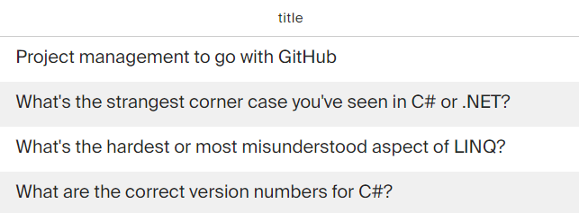
</tr>
</tbody>
</table>

### Запрос №10

Напишите запрос, который выгрузит данные о пользователях из Канады (англ. Canada). Разделите пользователей на три группы в зависимости от количества просмотров их профилей:

* пользователям с числом просмотров больше либо равным 350 присвойте группу 1;

* пользователям с числом просмотров меньше 350, но больше либо равно 100 — группу 2;

* пользователям с числом просмотров меньше 100 — группу 3.

Отобразите в итоговой таблице идентификатор пользователя, количество просмотров профиля и группу. Пользователи с количеством просмотров меньше либо равным нулю не должны войти в итоговую таблицу.

<table>
<thead>
<tr><td>Code</tr>
</thead>
<tbody>
<tr>
<td>

```sql
SELECT id,
    views,
    CASE
        WHEN views < 100 THEN 3
        WHEN views >= 100 AND views < 350 THEN 2
        ELSE 1
    END AS group 
FROM stackoverflow.users 
WHERE location LIKE '%Canada%' AND views > 0
LIMIT 5;
```
</tr>
<tr>
<td>Result</tr>
<tr>
<td>

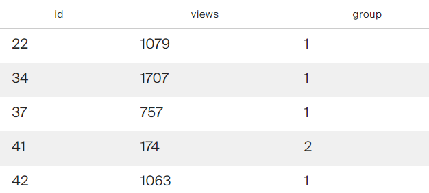
</tr>
</tbody>
</table>

### Запрос №11

Дополните предыдущий запрос. Отобразите лидеров каждой группы — пользователей, которые набрали максимальное число просмотров в своей группе. Выведите поля с идентификатором пользователя, группой и количеством просмотров. Отсортируйте таблицу по убыванию просмотров, а затем по возрастанию значения идентификатора.

<table>
<thead>
<tr><td>Code</tr>
</thead>
<tbody>
<tr>
<td>

```sql
WITH
data AS (SELECT id,
    views,
    CASE
        WHEN views < 100 THEN 3
        WHEN views >= 100 AND views < 350 THEN 2
        ELSE 1
    END AS group_user
FROM stackoverflow.users 
WHERE location LIKE '%Canada%' AND views > 0)

SELECT id, group_user, views
FROM (SELECT id,
                 views,
                 group_user,
                 MAX(views) OVER (PARTITION BY group_user ORDER BY views DESC) AS max_views
            FROM data) AS dat
WHERE max_views = views
ORDER BY views DESC, id;
```
</tr>
<tr>
<td>Result</tr>
<tr>
<td>

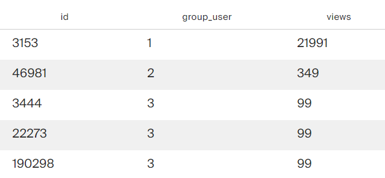
</tr>
</tbody>
</table>

### Запрос №12

Посчитайте ежедневный прирост новых пользователей в ноябре 2008 года. Сформируйте таблицу с полями:

* номер дня;

* число пользователей, зарегистрированных в этот день;

* сумму пользователей с накоплением.

<table>
<thead>
<tr><td>Code</tr>
</thead>
<tbody>
<tr>
<td>

```sql
SELECT EXTRACT(DAY FROM day),
    count_user,
    SUM(count_user) OVER(ORDER BY day)
FROM (SELECT DISTINCT(creation_date::DATE) AS day,
    COUNT(id) OVER(PARTITION BY creation_date::DATE) AS count_user
FROM stackoverflow.users
WHERE creation_date::DATE BETWEEN '2008-11-01' AND '2008-11-30') AS dat;
```
</tr>
<tr>
<td>Result</tr>
<tr>
<td>

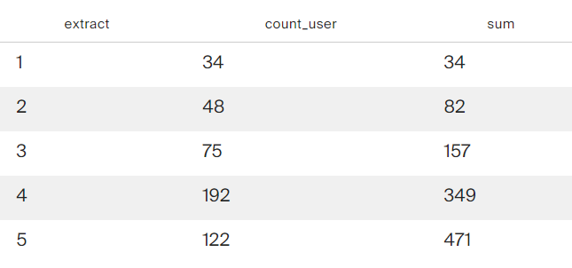
</tr>
</tbody>
</table>

### Запрос №13

Для каждого пользователя, который написал хотя бы один пост, найдите интервал между регистрацией и временем создания первого поста. Отобразите:

* идентификатор пользователя;

* разницу во времени между регистрацией и первым постом.

<table>
<thead>
<tr><td>Code</tr>
</thead>
<tbody>
<tr>
<td>

```sql
SELECT user_id,
    post_date-creation_date
FROM (SELECT DISTINCT(p.user_id) user_id,
    MIN(p.creation_date) OVER(PARTITION BY p.user_id) post_date,
    u.creation_date creation_date
FROM stackoverflow.posts p
JOIN stackoverflow.users u ON p.user_id=u.id) dat;
```
</tr>
<tr>
<td>Result</tr>
<tr>
<td>

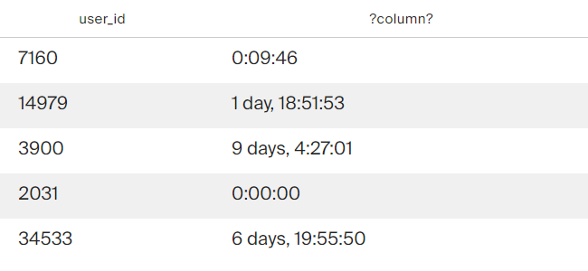
</tr>
</tbody>
</table>

## Аналитическая часть

### Запрос №1

Выведите общую сумму просмотров у постов, опубликованных в каждый месяц 2008 года. Если данных за какой-либо месяц в базе нет, такой месяц можно пропустить. Результат отсортируйте по убыванию общего количества просмотров.

<table>
<thead>
<tr><td>Code</tr>
</thead>
<tbody>
<tr>
<td>

```sql
SELECT DISTINCT(DATE_TRUNC('month',creation_date)::DATE),
    SUM(views_count) OVER(PARTITION BY DATE_TRUNC('month',creation_date)::DATE)
FROM stackoverflow.posts
WHERE EXTRACT(YEAR FROM creation_date) = 2008
ORDER BY SUM(views_count) OVER(PARTITION BY DATE_TRUNC('month',creation_date)::DATE) DESC
LIMIT 5;
```
</tr>
<tr>
<td>Result</tr>
<tr>
<td>

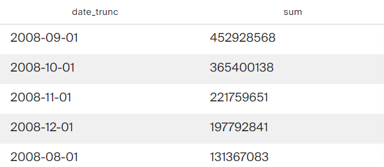
</tr>
</tbody>
</table>

### Запрос №2

Выведите имена самых активных пользователей, которые в первый месяц после регистрации (включая день регистрации) дали больше 100 ответов. Вопросы, которые задавали пользователи, не учитывайте. Для каждого имени пользователя выведите количество уникальных значений `user_id`. Отсортируйте результат по полю с именами в лексикографическом порядке.

<table>
<thead>
<tr><td>Code</tr>
</thead>
<tbody>
<tr>
<td>

```sql
SELECT u.display_name,
       COUNT(DISTINCT p.user_id)
FROM stackoverflow.posts AS p
JOIN stackoverflow.users AS u 
ON p.user_id=u.id
WHERE p.creation_date::date BETWEEN u.creation_date::date AND (u.creation_date::date + INTERVAL '1 month') 
      AND post_type_id = 2
GROUP BY u.display_name
HAVING COUNT(p.id) > 100
ORDER BY u.display_name
LIMIT 5;
```
</tr>
<tr>
<td>Result</tr>
<tr>
<td>

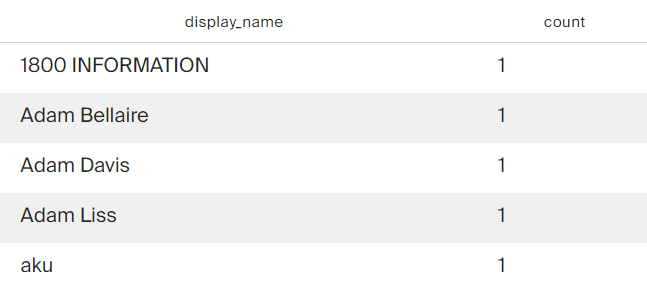
</tr>
</tbody>
</table>

### Запрос №3

Выведите количество постов за 2008 год по месяцам. Отберите посты от пользователей, которые зарегистрировались в сентябре 2008 года и сделали хотя бы один пост в декабре того же года. Отсортируйте таблицу по значению месяца по убыванию.

<table>
<thead>
<tr><td>Code</tr>
</thead>
<tbody>
<tr>
<td>

```sql
WITH
use AS (SELECT id
FROM stackoverflow.users
WHERE DATE_TRUNC('month',creation_date)::DATE = '2008-09-01'),

use_id AS (SELECT DISTINCT(p.user_id)
FROM stackoverflow.posts p
JOIN use ON p.user_id=use.id
WHERE DATE_TRUNC('month',p.creation_date)::DATE = '2008-12-01')

SELECT DISTINCT(DATE_TRUNC('month',creation_date)::DATE),
    COUNT(id) OVER(PARTITION BY DATE_TRUNC('month',creation_date)::DATE)
FROM stackoverflow.posts p
JOIN use_id ON p.user_id=use_id.user_id
WHERE DATE_TRUNC('year',p.creation_date)::DATE = '2008-01-01'
ORDER BY DATE_TRUNC('month',creation_date)::DATE DESC;
```
</tr>
<tr>
<td>Result</tr>
<tr>
<td>

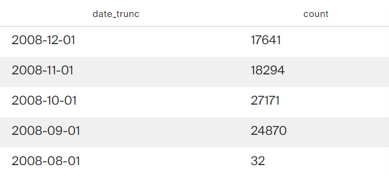
</tr>
</tbody>
</table>

### Запрос №4

Используя данные о постах, выведите несколько полей:

* идентификатор пользователя, который написал пост;

* дата создания поста;

* количество просмотров у текущего поста;

* сумма просмотров постов автора с накоплением.

Данные в таблице должны быть отсортированы по возрастанию идентификаторов пользователей, а данные об одном и том же пользователе — по возрастанию даты создания поста.

<table>
<thead>
<tr><td>Code</tr>
</thead>
<tbody>
<tr>
<td>

```sql
SELECT user_id,
    creation_date,
    views_count,
    SUM(views_count) OVER(PARTITION BY user_id ORDER BY creation_date)
FROM stackoverflow.posts
ORDER BY user_id,creation_date
LIMIT 5;
```
</tr>
<tr>
<td>Result</tr>
<tr>
<td>

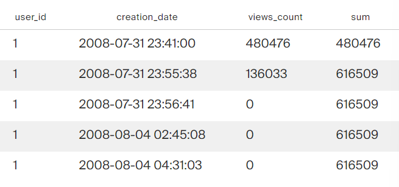
</tr>
</tbody>
</table>

### Запрос №5

Сколько в среднем дней в период с 1 по 7 декабря 2008 года включительно пользователи взаимодействовали с платформой? Для каждого пользователя отберите дни, в которые он или она опубликовали хотя бы один пост. Нужно получить одно целое число — не забудьте округлить результат.

<table>
<thead>
<tr><td>Code</tr>
</thead>
<tbody>
<tr>
<td>

```sql
WITH 
post AS (SELECT user_id,
    COUNT(DISTINCT(DATE_TRUNC('day', creation_date)::date))
FROM stackoverflow.posts
WHERE creation_date::date BETWEEN '2008-12-01' AND '2008-12-07'
GROUP BY user_id)

SELECT ROUND(AVG(count))
FROM post;
```
</tr>
<tr>
<td>Result</tr>
<tr>
<td>

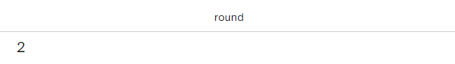
</tr>
</tbody>
</table>

### Запрос №6

На сколько процентов менялось количество постов ежемесячно с 1 сентября по 31 декабря 2008 года? Отобразите таблицу со следующими полями:

* Номер месяца.

* Количество постов за месяц.

* Процент, который показывает, насколько изменилось количество постов в текущем месяце по сравнению с предыдущим.

Если постов стало меньше, значение процента должно быть отрицательным, если больше — положительным. Округлите значение процента до двух знаков после запятой.

Напомним, что при делении одного целого числа на другое в PostgreSQL в результате получится целое число, округлённое до ближайшего целого вниз. Чтобы этого избежать, переведите делимое в тип `numeric`.

<table>
<thead>
<tr><td>Code</tr>
</thead>
<tbody>
<tr>
<td>

```sql
WITH
dat AS (SELECT DISTINCT(EXTRACT(MONTH FROM creation_date)) month_creat,
    COUNT(id) OVER(PARTITION BY EXTRACT(MONTH FROM creation_date)) count_month
FROM stackoverflow.posts p
WHERE creation_date::DATE BETWEEN '2008-09-01' AND '2008-12-31'),

lag_dat AS (SELECT month_creat,
    count_month,
    LAG(count_month) OVER() lag
FROM dat)

SELECT month_creat,
    count_month,
    ROUND((count_month::numeric/lag-1)*100,2)
FROM lag_dat;
```
</tr>
<tr>
<td>Result</tr>
<tr>
<td>

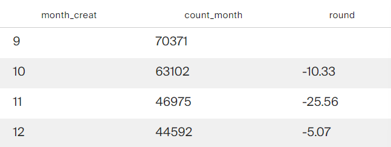
</tr>
</tbody>
</table>

### Запрос №6

Найдите пользователя, который опубликовал больше всего постов за всё время с момента регистрации. Выведите данные его активности за октябрь 2008 года в таком виде:

* номер недели;

* дата и время последнего поста, опубликованного на этой неделе.

<table>
<thead>
<tr><td>Code</tr>
</thead>
<tbody>
<tr>
<td>

```sql
WITH
max_post AS (SELECT DISTINCT(user_id),
    COUNT(id) OVER(PARTITION BY user_id)
FROM stackoverflow.posts
ORDER BY COUNT(id) OVER(PARTITION BY user_id) DESC
LIMIT 1)

SELECT EXTRACT(WEEK FROM p.creation_date) week_creation,
       MAX(p.creation_date) creation_date
FROM  max_post m
JOIN stackoverflow.posts p ON m.user_id=p.user_id
WHERE DATE_TRUNC('month', p.creation_date)::date = '2008-10-01'
GROUP BY EXTRACT(WEEK FROM p.creation_date);
```
</tr>
<tr>
<td>Result</tr>
<tr>
<td>

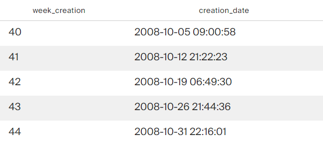
</tr>
</tbody>
</table>
